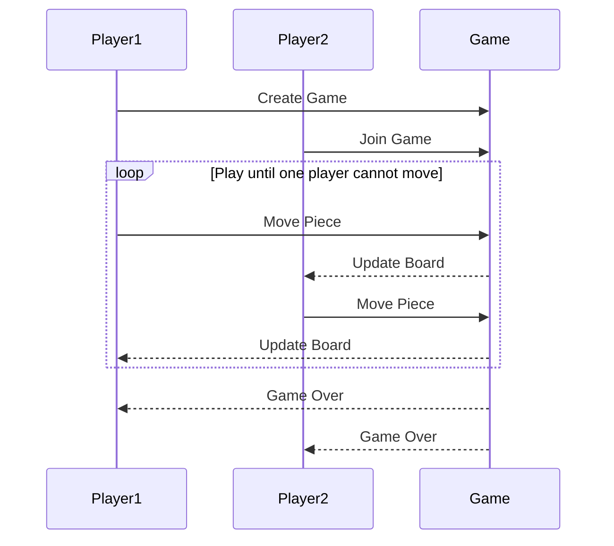

# jump-well-chess

## about of the game

This is a game of chess is a simple board game that allows 2 players to play.
The chessboard has 5 positions, with each player occupying 2 positions respectively.
every player can step once until some one of players can not move in grids the game is over.
[wikipedia](https://zh.wikipedia.org/wiki/%E8%A3%A4%E8%A3%86%E6%A3%8B#)

## the video of the starknet how to play the game

## Game Loop

The following game loop when some player can not move

